# CAMS API Documentation: Streamlining Capstone Project Management for the Computer Science Department at UMass Boston

# CAMS API Documentation Overview:

The CAMS API (Capstone Project Management System) documentation outlines a set of endpoints designed to facilitate the efficient assignment and supervision of capstone projects for students within the Computer Science Department at the University of Massachusetts, Boston.

This professionally crafted web application, developed using the MERN stack, aims to streamline the capstone project management process specifically for Professor Kenneth Fletcher and other educators within the institution.

## Original Development Team:

    1. Rakshith Reddy M
    2. Bapi Raju K
    3. Chandana

## Subsequent Development Team:
    1. Vidhya
    2. Qudseen
    3. Vishwa
    4. Sasank

## Guidance by:
    Professor [Dr.] Kenneth Fletcher

## Development History:
### 1. Initial Development (CS682 Software Development Laboratory):
        - Developed by Rakshith Reddy M, Bapi Raju K, and Chandana.

### 2. Further Development:
        - Vidhya, Qudseen, Vishwa, and Sasank contributed to additional development and enhancements.

## Acknowledgements:
    The development of the CAMS Portal was made possible through the guidance and support of Professor [Dr.] Kenneth Fletcher.

# Issues Identified and addressed in the second phase of development:

## Issues 

### Project Allocation leads to non-functional tab
##### Before:
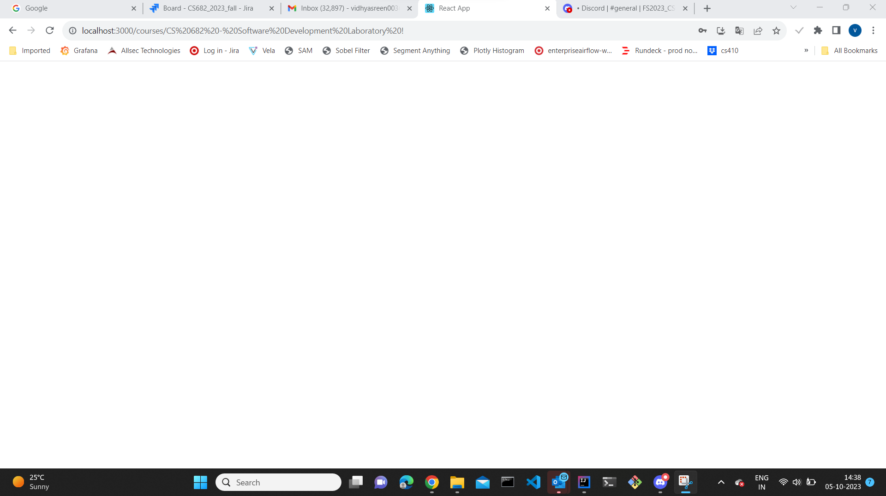

##### After:
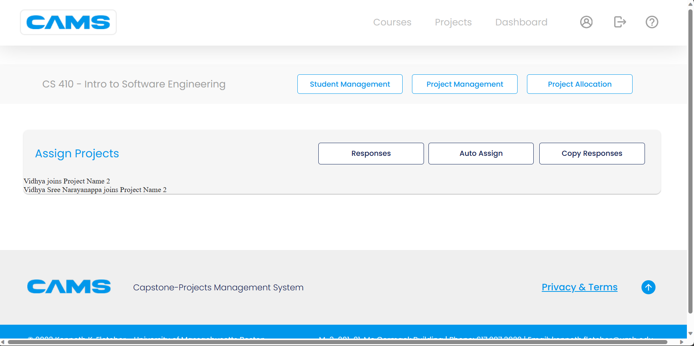

\
Now project allocation redirects the page to assign projects styled papaer as expected. In that page using the preferences set by students for the projects published  in that course, the projects are assigned to the students

\
In <strong>CoursePage</strong>, the <strong>setComponent</strong> function is used to update the component state based on user interactions. The component state determines which part of the UI is rendered on the page.

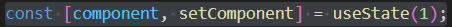

\
 **useState(1)** initializes the **component** state with the value 1. This means that by default, the **CoursesStudents** component (corresponding to component value 1) will be rendered when the page loads.

\

\
Three clickable elements representing different sections: **Student Management**, **Project Management**, and **Project Allocation**. Each element has an __onClick__ event handler that calls the __setComponent__ function with a specific value when clicked.

* When "Student Management" is clicked **(onClick={() => setComponent(1)})**, it sets the component **state** to 1.
* When "Project Management" is clicked **(onClick={() => setComponent(2)})**, it sets the component **state** to 2.
* When "Project Allocation" is clicked **(onClick={() => setComponent(3)})**, it sets the component **state** to 3.

\
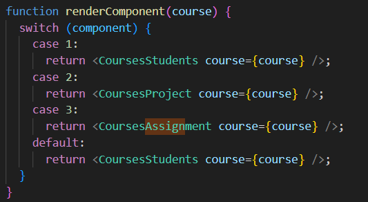

\
The value passed to **setComponent** determines which section should be rendered, and the **renderComponent** function uses this state value to conditionally render the appropriate component (**CoursesStudents**, **CoursesProject**, or **CoursesAssignment**). The **component** state is then updated accordingly whenever the user clicks on one of the section buttons.

### Dahboard is empty

##### Before:
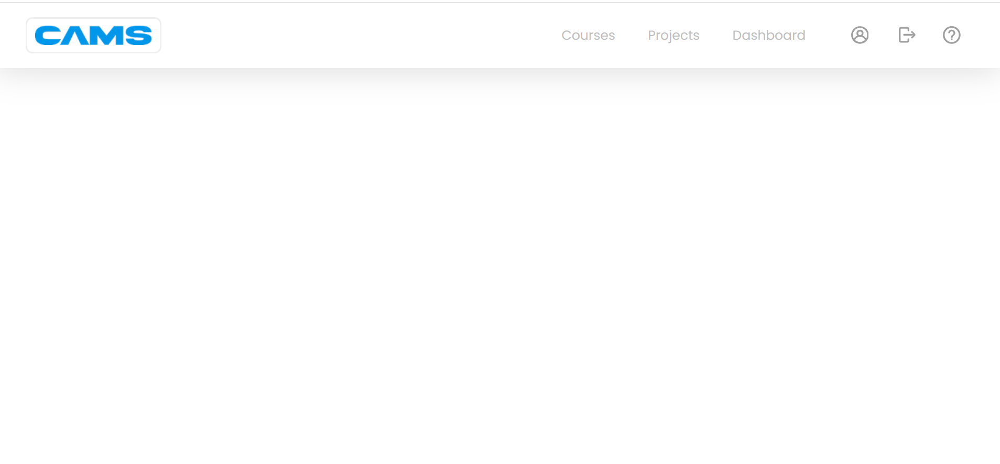

##### After:
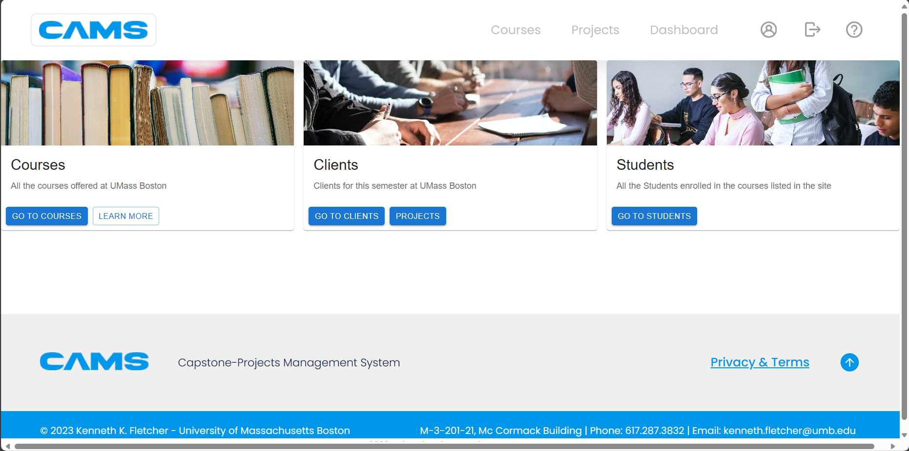

\
The **Admin dashboard** allows the admin to navigate to and between **Students**, **Courses**, **Clients** and **Projects**. And admin can access his profile through admin dashboard also can manage students, clients and projects.

\
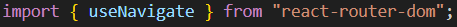
\
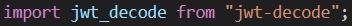
\
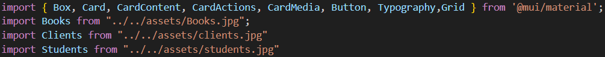

##### Card Creation:
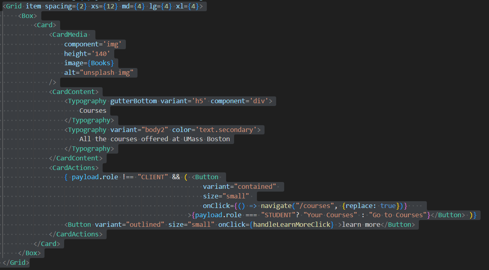
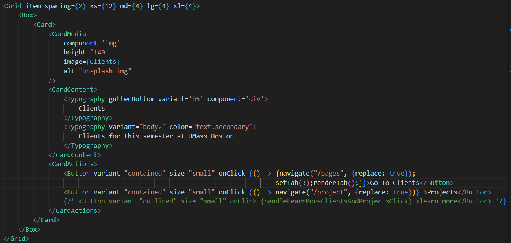
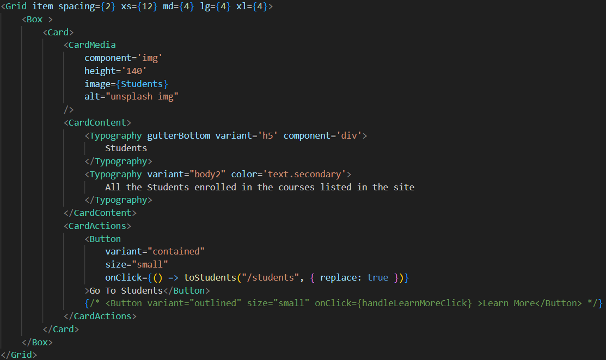

\
In this code snippet:

* Three cards for Courses, Clients, and Students are created using Material-UI's Card components.
* Each card has a CardMedia component to display an image, a CardContent component for the content, and CardActions for buttons.
* The buttons include actions such as navigating to specific pages (/courses, /pages, /students) and triggering functions (handleLearnMoreClick).

##### Redirection:
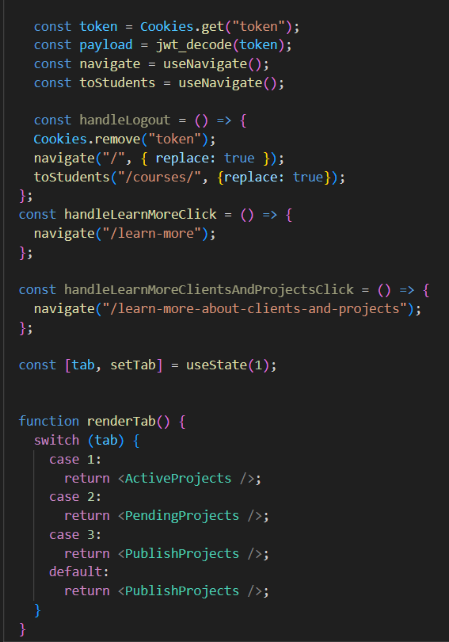

\
In this code snippet:

* The useNavigate hook is used to obtain the navigate function for programmatic navigation.
* Event handlers like handleLogout, handleLearnMoreClick, and handleLearnMoreClientsAndProjectsClick use the navigate function to redirect users to different pages when buttons are clicked.
* The combination of card creation and navigation event handlers provides a visually appealing dashboard with clickable sections that redirect the user to specific pages or trigger relevant actions.

### Students Page
##### Before:
    Null
##### After:
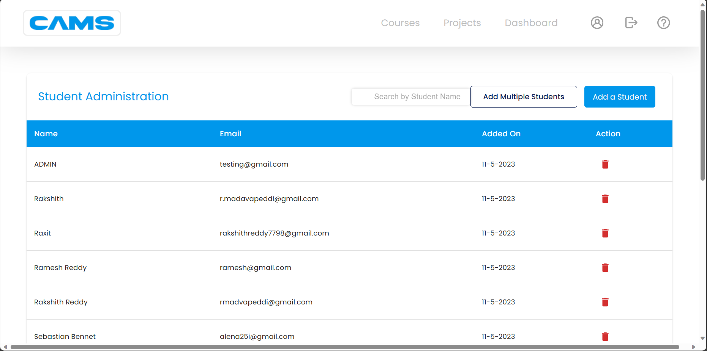

##### Import Statements:
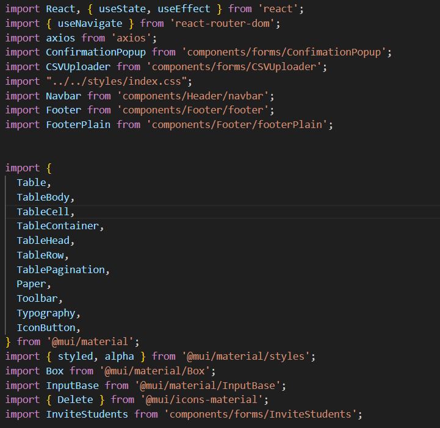

\
These are import statements for various React and Material-UI components, as well as custom components (**ConfirmationPopup**, **CSVUploader**, **Navbar**, **Footer**, and **FooterPlain**). It also imports styling-related components from Material-UI.

##### Styled Components:
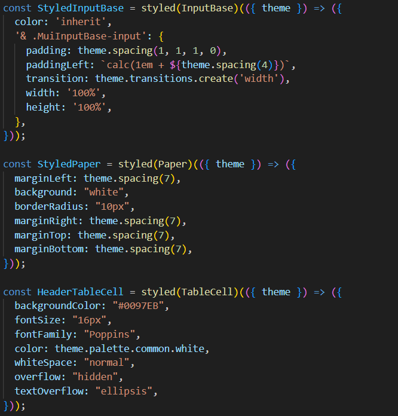
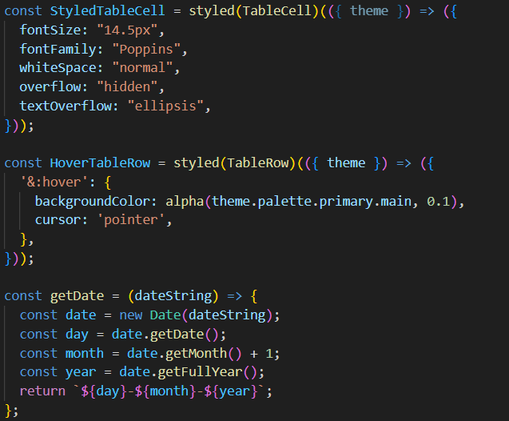

\
These are styled components using the styled utility from Material-UI. They define the styling for various elements such as **InputBase**, **Paper**, **TableCell**, and **TableRow**

##### Functional Component:
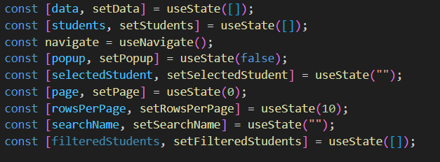

\
This is the main functional component named **Studentdata**. It uses React hooks (**useState**, **useEffect**) to manage state variables.

##### Event Handlers:
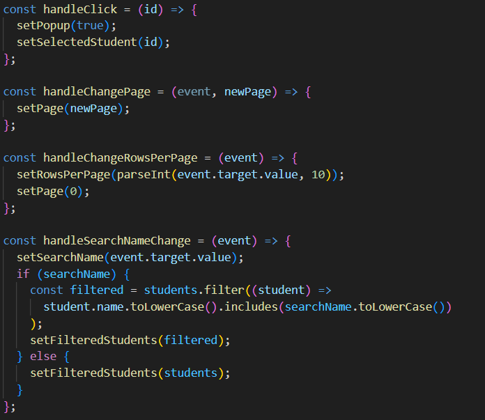

\
These functions handle various events such as clicking on a table row, changing the page, changing rows per page, and changing the search name.

##### useEffect for Fetching Data:
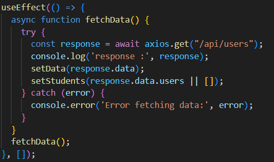

\
The **useEffect** hook is used to fetch data from the server when the component mounts.

##### Delete User Function:
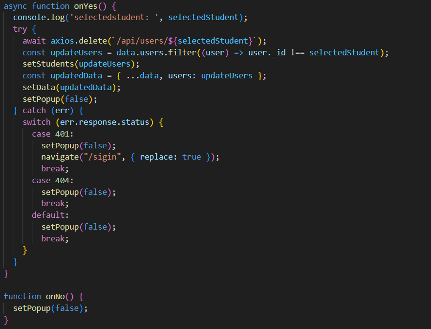

\
These functions handle the deletion of a user when the confirmation popup is confirmed or denied.

##### Render JSX:
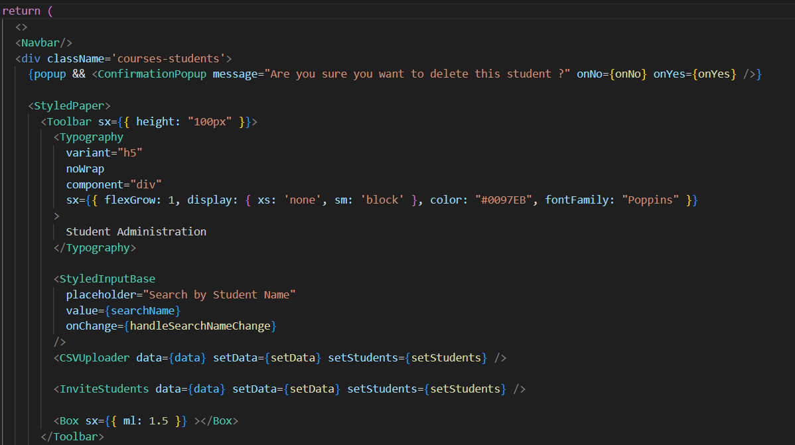
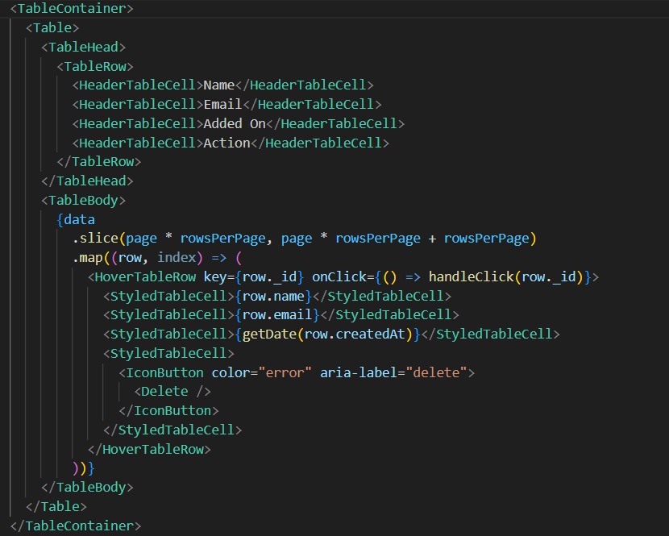
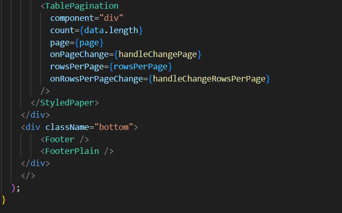

\
The **return** statement renders the JSX structure of the component. It includes a **Navbar**, a main content section (**courses-students**), and a **Footer**.

##### Table and Pagination:
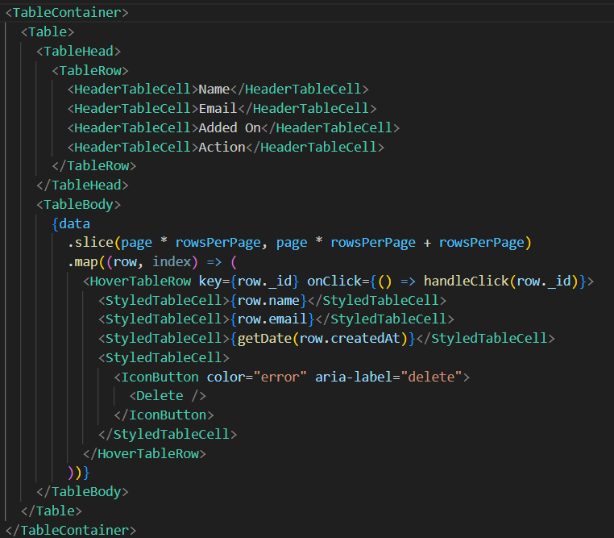
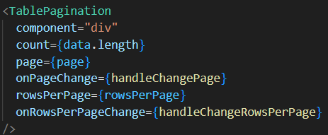

\
This section includes a **Toolbar** for search and actions, a **TableContainer** for displaying user data, and **TablePagination** for handling pagination.

##### TableRow and TableCell:
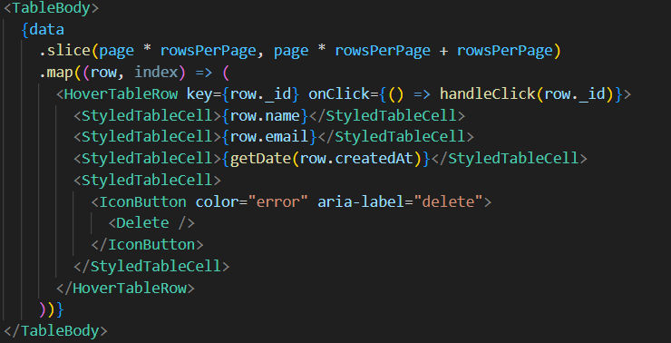

\
This maps over the user data to create **TableRow** components with **TableCell** components for each user's details.

\
Overall, this component fetches user data, displays it in a table, allows searching, and provides options for deleting users. It also includes styling and uses Material-UI components for a consistent design.

### LearnMorePage Component Documentation

##### Overview

\
The **LearnMorePage** component is a React functional component that represents the page providing information about the courses offered at UMass Boston. It includes details about the university's key features, diverse disciplines, and majors. The page encourages users to explore different departments and provides links for additional information.

##### Structure

\
The component is structured using semantic HTML elements and leverages the Material-UI library for styling.

##### Import Statements:
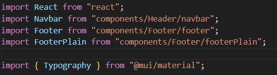

\
The necessary dependencies are imported, including React, custom components (**Navbar**, **Footer**, and **FooterPlain**), and **Material-UI** components (Typography).

##### Component Definition:
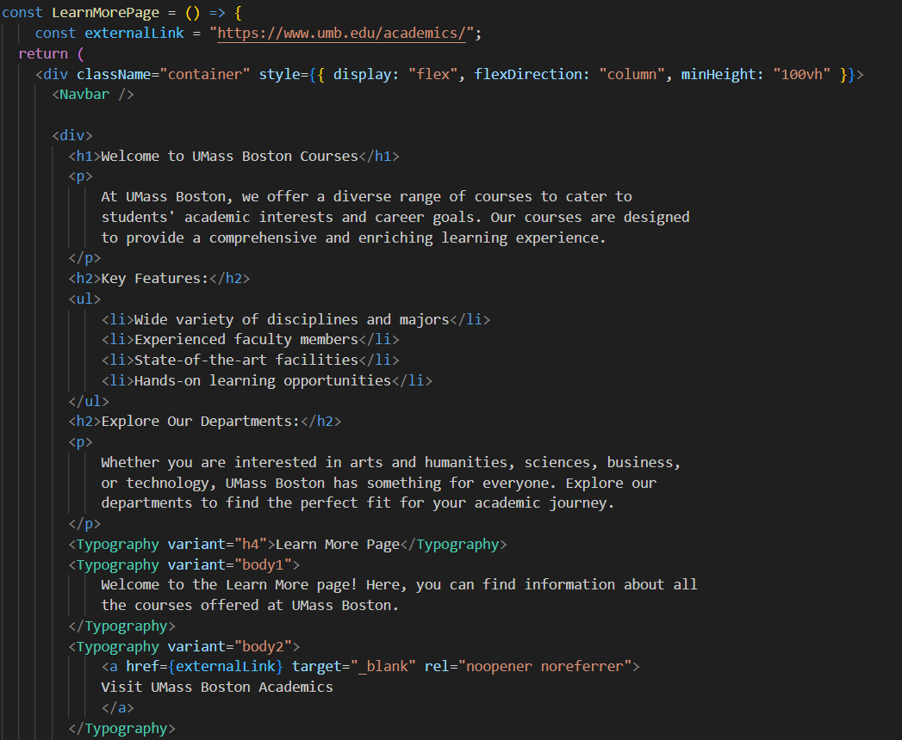
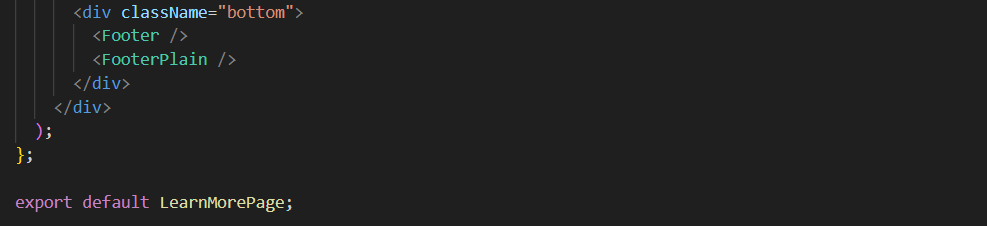

##### Container and Styling:
* The component is wrapped in a container div with flexbox styling to ensure proper layout.

##### Navbar and Footer:
* The Navbar component is included at the top, providing navigation functionality.
* Two footer components (Footer and FooterPlain) are included at the bottom for additional information.
Content Section:

* The component includes sections with headers, paragraphs, and lists to present information about UMass Boston's courses, key features, and departments.
Learn More Section:

* A "Learn More" section provides a brief description of the Learn More page, inviting users to explore detailed information about the courses offered.
##### External Link:

* A link is provided to direct users to the UMass Boston Academics page. The link opens in a new tab (target="_blank") for user convenience.

##### Usage
* To use this component, include it in the routing configuration of the application or as part of a parent component responsible for rendering pages.

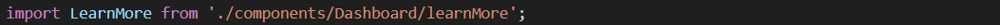
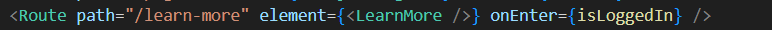

##### Notes

* The component uses Material-UI's Typography component for consistent and stylized text.
* The externalLink variable holds the URL for the external link, providing easy maintenance and updates.

##### Recommendations

* Ensure that the external link is kept up-to-date with the relevant UMass Boston Academics page.
* Customize the content and styling as needed to align with the overall theme of the application.
* Consider adding more sections or links based on the specific information you want to present on the Learn More page.

### ClientDashBoard Component Documentation

##### Overview
The ⁠ ClientDashBoard ⁠ component is a React component designed for managing and displaying projects in a dashboard interface. It includes features like project preview, search functionality, pagination, and inviting learners via email.

##### Component Structure
•⁠  ⁠*Navbar*: A top navigation bar.
  ⁠ jsx
  <Navbar position="relative"></Navbar>
   ⁠
•⁠  ⁠*ProjectPreview*: A modal for previewing project details.
  ⁠ jsx
  {preview && <ProjectPreview projectId={selectedProject} handleClose={handleClose} />}
   ⁠
•⁠  ⁠*Grid Layout*: Material-UI Grid for responsive layout.
  ⁠ jsx
  <Grid container spacing={2} justifyContent="center">...</Grid>
   ⁠
•⁠  ⁠*Cards and Dialogs*: Used for displaying projects and forms.
  ⁠ jsx
  <Card>...</Card>
  <Dialog>...</Dialog>
   ⁠
•⁠  ⁠*Search Functionality*: Allows searching for projects by name.
  ⁠ jsx
  <Search>...</Search>
   ⁠
•⁠  ⁠*Pagination*: Controls for navigating through projects.
  ⁠ jsx
  <TablePagination>...</TablePagination>
   ⁠
•⁠  ⁠*Forms*: For submitting new experiences and inviting learners.
  ⁠ jsx
  <form>...</form>
   ⁠

##### State Management
•⁠  ⁠⁠ useState ⁠ hooks are used to manage component states, including:
  ⁠ jsx
  const [projects, setProjects] = useState([]);
  const [popup, setPopup] = useState(false);
  
   ⁠

##### API Interactions
•⁠  ⁠*Fetching Projects*: An ⁠ axios ⁠ GET request to '/api/projects' retrieves project data.
  ⁠ jsx
  const response = await axios.get('/api/projects');
   ⁠
•⁠  ⁠*Submitting Experiences*: An ⁠ axios ⁠ POST request to '/api/experience' submits new experience data.
  ⁠ jsx
  const response = await axios.post("/api/experience", { experienceText, skillsText });
   ⁠
•⁠  ⁠*Inviting Learners*: Email invitation logic (currently mocked with console logs).
  ⁠ jsx
  console.log('Sending invites to:', email);
   ⁠

##### Key Functionalities
•⁠  ⁠*Search*: Filters projects based on the search input.
  ⁠ jsx
  const handleSearchNameChange = (event) => {...};
   ⁠
•⁠  ⁠*Pagination*: Handles page changes and rows per page for project listing.
  ⁠ jsx
  const handleChangePage = (event, newPage) => {...};
   ⁠
•⁠  ⁠*Form Submission*: Handles experience and skills data submission.
  ⁠ jsx
  const handleFormSubmit = async (experienceText, skillsText) => {...};
   ⁠
•⁠  ⁠*Inviting Learners*: Functionality to send email invitations (UI only).
  ⁠ jsx
  const sendInvites1 = async () => {...};
   ⁠
•⁠  ⁠*Project Expansion*: Expands project cards to show more details.
  ⁠ jsx
  const handleExpandClick = (projectId) => {...};
   ⁠

##### Styling
•⁠  ⁠Material-UI's ⁠ styled ⁠ API and components like ⁠ Box ⁠, ⁠ Card ⁠, ⁠ Button ⁠ are used for styling.
  ⁠ jsx
  const Search = styled('div')(({ theme }) => ({...}));
   ⁠
•⁠  ⁠Custom styled components are created for specific elements like ⁠ Search ⁠, ⁠ HoverTableRow ⁠, ⁠ StyledTableCell ⁠.

##### Notes
•⁠  ⁠The component relies on Material-UI for UI components and styling.
•⁠  ⁠State management is achieved using React's ⁠ useState ⁠ and ⁠ useEffect ⁠ hooks.
•⁠  ⁠The code includes placeholders for server interactions (API calls).

### Can't close projects tab

##### Before:
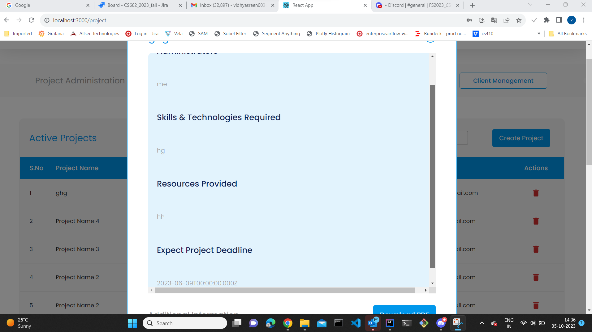

##### After:
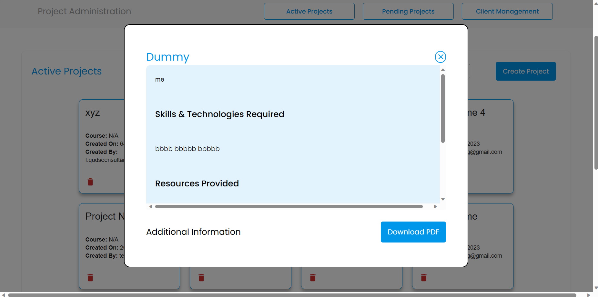

### Cams Portal Deployment Documentation

\
This documentation provides step-by-step instructions on deploying the CAMS (Capstone Project Management System) portal on a Render server. Render is a cloud platform that simplifies deployment and hosting.

#### Prerequisites

Before you begin, ensure you have the following:

##### Render Account:

\
Create an account on Render if you don't have one.

##### Source Code:

\
Make sure you have the latest version of the CAMS portal source code.

##### Environment Configuration:

* Prepare environment configuration files, such as .env or .env.production, containing necessary environment variables like database connection strings, API keys, and other configurations.

##### Deployment Steps
1. Create a New Web Service on Render:
* Log in to your Render account.

* Click on the Create New button in the dashboard.

* Choose Web Service.

* Connect your GitHub, GitLab, or Bitbucket repository where the CAMS portal source code is hosted.

* Select the branch you want to deploy.

2. Configure Build Settings:
* In the Render dashboard, navigate to your service.

* Go to the Settings tab.

* Under the Builds & Deploys section, choose your build environment. For a Node.js app, you might select Node.js.

* Set the build command. For example, if your CAMS portal is a React app, the build command might be npm run build.

* Set the start command. This is typically npm start for Node.js apps.

3. Configure Environment Variables:
* In the same Settings tab, under the Environment section, add environment variables required by your CAMS portal.

    * For example:
        * REACT_APP_API_BASE_URL: The base URL of your API.
        * REACT_APP_API_KEY: API key for accessing services.
4. Database Configuration (if applicable):
* If your CAMS portal uses a database, ensure that your database is accessible from Render.

* Update the database connection string or other database-related configurations in your environment variables.

5. Save Changes and Deploy:
* Save your changes.

Trigger a manual deployment or wait for Render to automatically deploy your app.

Render will provide a live URL for your deployed CAMS portal.

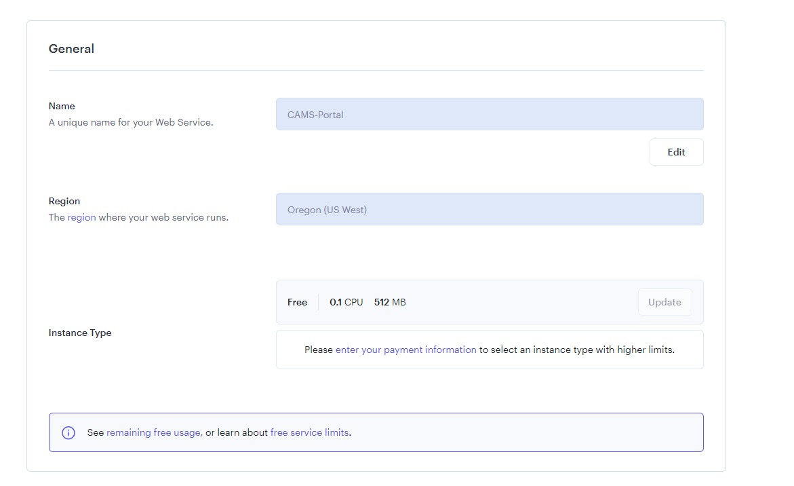
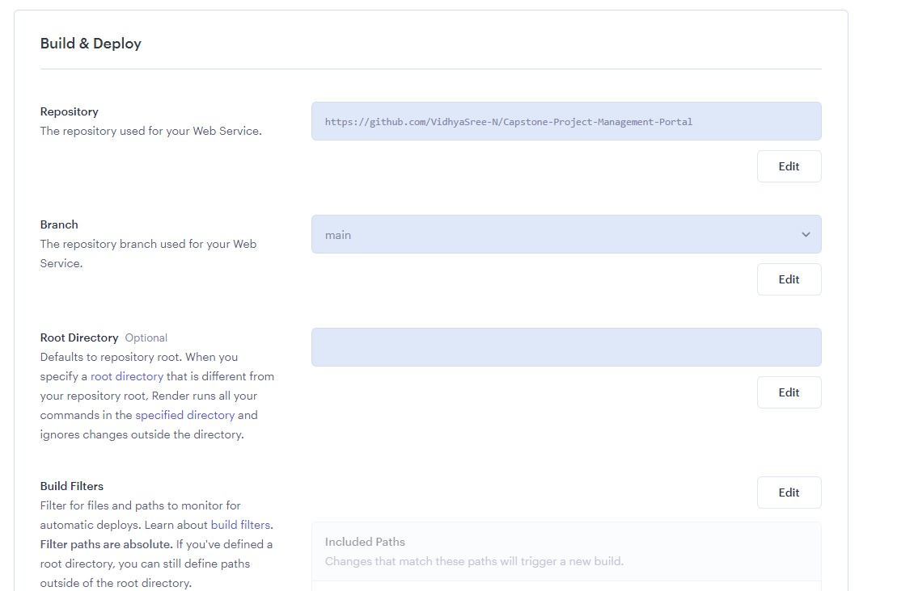
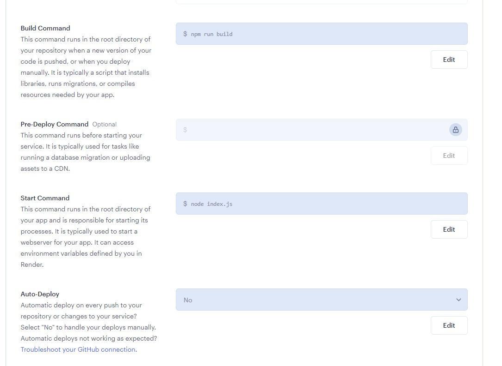

