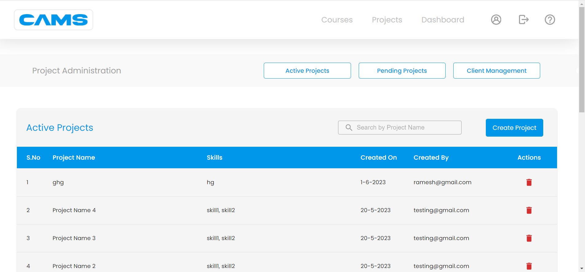
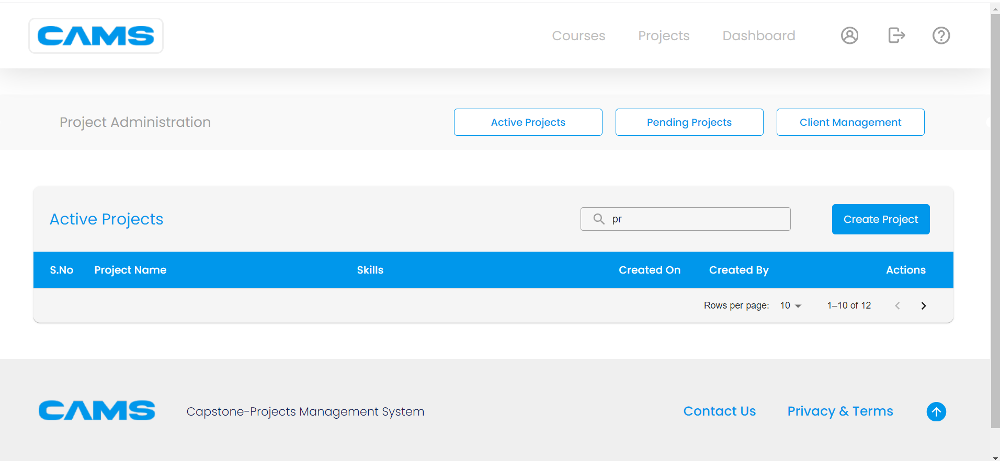
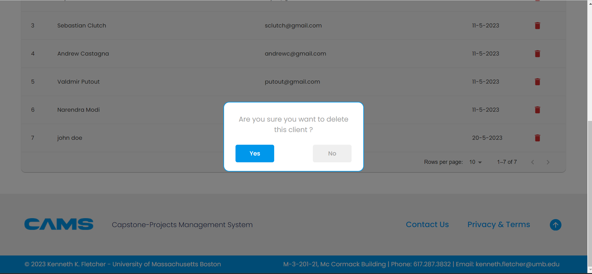
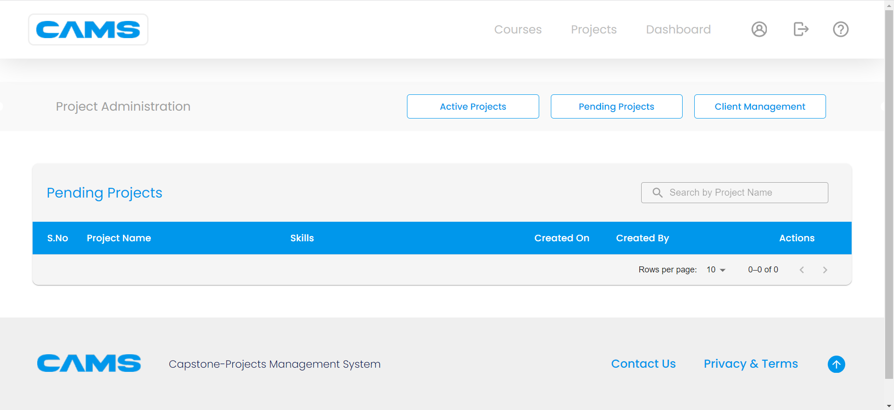
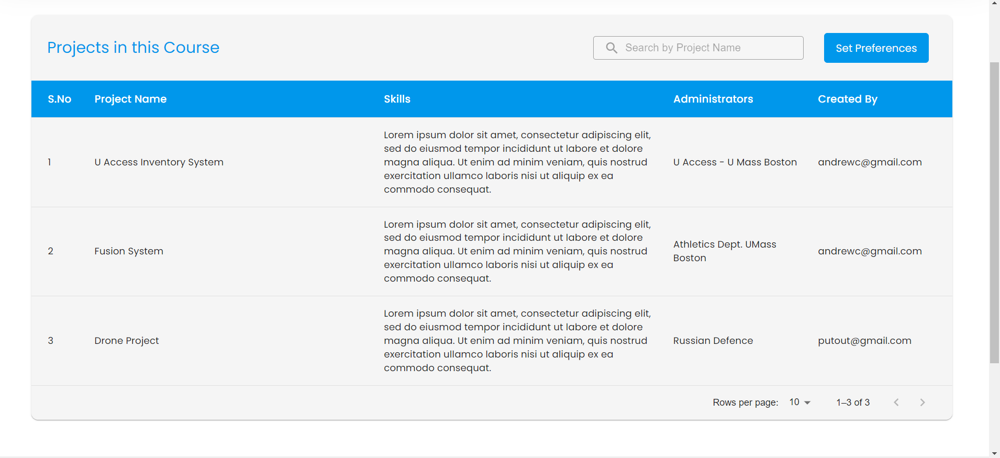
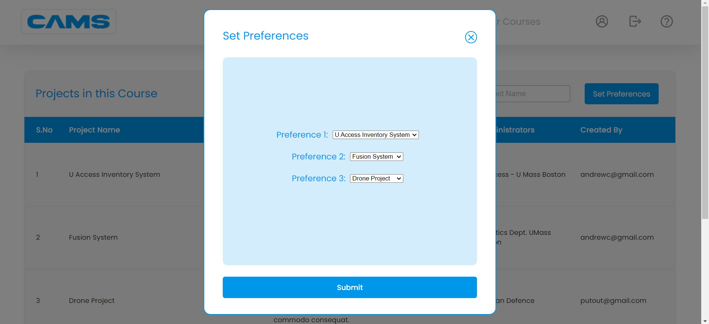
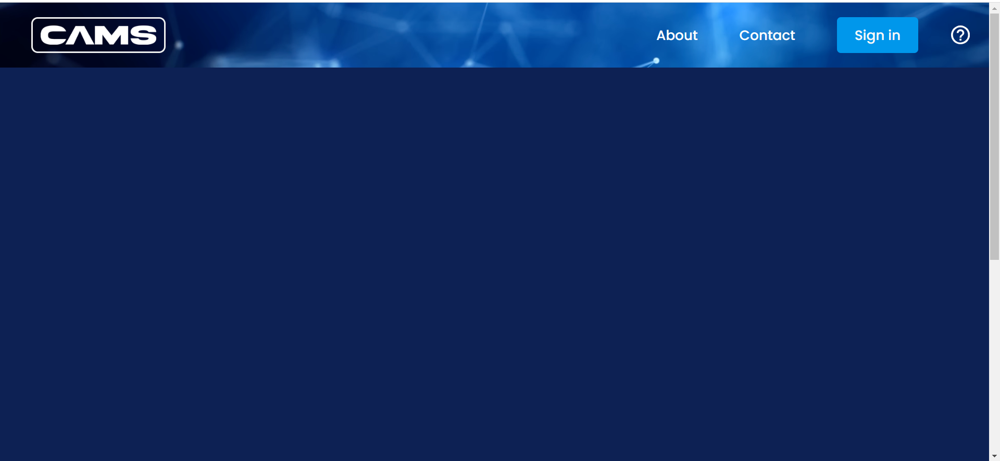
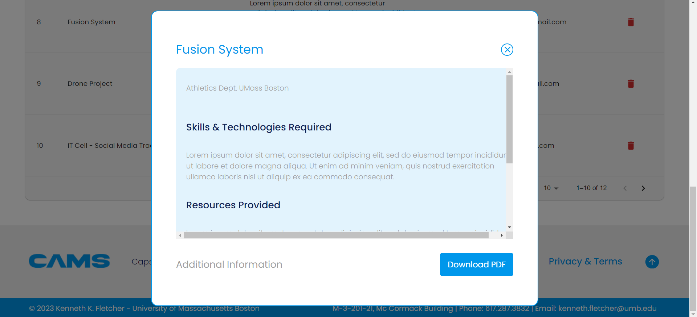

# CS682-Capstone Project Management System

## Existing Gaps:
- Dahboard is empty

- Project Allocation leads to non-functional tab

  
- Can't close projects tab

  
- No way to know if project belongs to particular course

  
- Search icon is not working

  
- Delete client is not working

  
- User profile,cams and help icons are not clickable

  
- Projects Missing

  
- Cannot submit preferences

  
- Homepage issues

  
- Download PDF is not working
